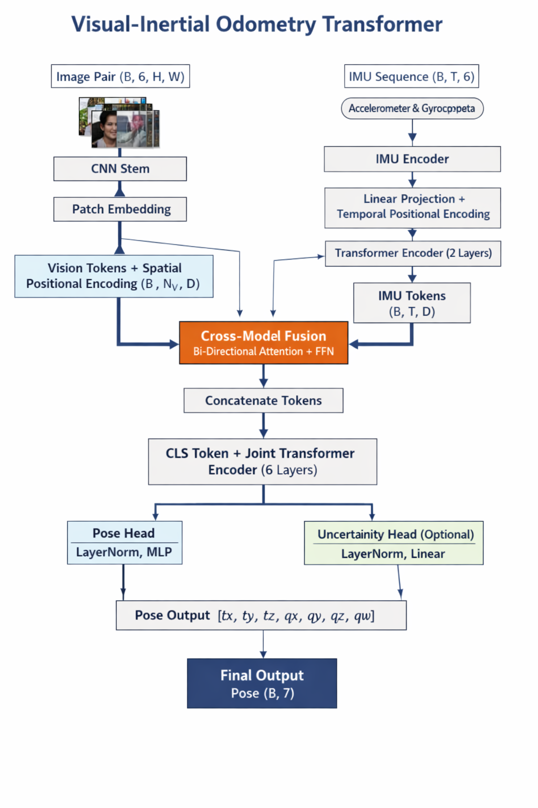
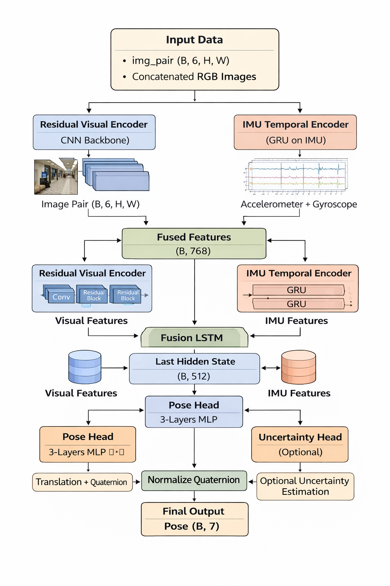

# 🚗 Visual-Inertial Odometry (Deep Learning)

A deep learning framework for **Visual-Inertial Odometry (VIO)** using two fundamentally different architectures:

- 🧠 Transformer-based cross-modal fusion  
- 🔁 CNN + LSTM recurrent fusion  

The system estimates **6-DoF relative pose (translation + rotation)** from:

- 📷 Image pairs  
- 📡 IMU measurements  

---

## 🎥 Demo (Transformer Model)

Below is a sample trajectory output from the Transformer-based model:

> ⚠️ GitHub may not autoplay videos — click to view

<video src="images/smooth_vio.mp4" controls width="100%"></video>

---

## 📌 Overview

Visual-Inertial Odometry is a core component in:

- 🚗 Autonomous driving  
- 🚁 Drones  
- 🤖 Robotics  
- 🥽 AR/VR  

This project explores **two fundamentally different learning paradigms** for VIO:

| Model              | Type          | Fusion Strategy      |
|--------------------|---------------|----------------------|
| Transformer VIO    | Attention-based | Cross-modal attention |
| CNN + LSTM VIO     | Recurrent     | Feature concatenation |

This enables a **direct comparison between attention vs recurrence** in sensor fusion.

---

# 🧠 Model 1: Transformer-based VIO (Proposed)

## 🔍 Key Features

- Cross-modal attention between vision and IMU  
- Sinusoidal positional encoding (temporal + spatial)  
- Pre-layer normalization (stable training)  
- Bidirectional fusion (vision ↔ IMU)  
- Global reasoning via Transformer  

---

## 🏗 Architecture



---

## ⚙️ Key Improvements Over Standard ViT

- ✅ CNN feature extractor before patching  
- ✅ Temporal Transformer for IMU  
- ✅ Cross-attention fusion (not simple concatenation)  
- ✅ Pre-LN Transformer (more stable training)  
- ✅ Learned CLS positional embedding  
- ✅ Quaternion normalization  

---

# 🔁 Model 2: CNN + LSTM VIO (Baseline)

## 🔍 Key Features

- CNN-based visual feature extraction (FlowNet-style)  
- IMU encoded via MLP  
- Temporal modeling via LSTM  
- Late fusion of visual + IMU features  

---

## 🏗 Architecture



---

# 🧪 Why Two Models?

This project is designed for **scientific comparison**:

| Property           | Transformer          | CNN + LSTM          |
|--------------------|----------------------|---------------------|
| Spatial modeling   | Global attention     | Local CNN           |
| Temporal modeling  | Attention            | Recurrence          |
| Fusion             | Cross-attention      | Concatenation       |
| Parallelism        | High                 | Low                 |
| Memory usage       | High                 | Moderate            |

---

# 📊 Training Objective

The model predicts:  
`[tx, ty, tz, qw, qx, qy, qz]`

### Loss Function

**Loss = Translation MSE + 10 × Rotation Loss**

- **Translation** → Mean Squared Error  
- **Rotation** → Geodesic quaternion loss  

---

# 📦 Installation

### Prerequisites

- Python 3.8+
- PyTorch (with CUDA support recommended for training)
- Git

### 1. Clone the Repository

```bash
git clone https://github.com/YOUR_USERNAME/visual-inertial-odometry.git
cd visual-inertial-odometry
```

### 2. Install Dependencies
``` bash
pip install -r requirements.txt
```

# 🚀 Training
### KITTI Dataset
`python3 train.py /path/to/kitti --epochs 10 --batch-size 4`

### Euroc Dataset
`python3 train.py /path/to/euroc --epochs 10 --batch-size 4`

## Training Output
Checkpoints and logs are saved in:
``` bash
checkpoints/
   run_TIMESTAMP/
      best_model.pth
      loss_curve.png
```

# 🗂 Dataset Support
## 1. EuRoC MAV Dataset
Expected structure:
``` bash
dataset/
   euroc/
      V2_03_difficult/
         mav0/
            cam0/data/*.png
            imu0/data.csv
            state_groundtruth_estimate0/data.csv
```

## 2. KITTI Odometry Dataset
Expected structure:
``` bash
dataset/
   kitti/
      sequences/
         00/image_0/*.png
      poses/00.txt
```

# 🔄 Data Processing
The dataloader handles:
   - Loading image sequences
   - Synchronizing IMU data
   - Computing relative poses
   - Resizing images to 640 × 192

Each training sample contains:
   - imgs → image sequence
   - imus → IMU data
   - poses → ground truth relative poses

# ⚙️ Model Configuration (Transformer)
   - Embedding dim: 256
   - Layers: 6
   - Heads: 8
   - Image input: 640 × 192
   - IMU sequence length: 3
